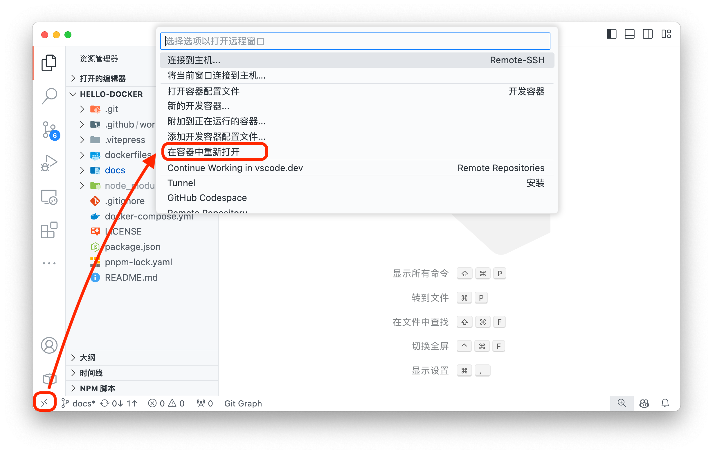
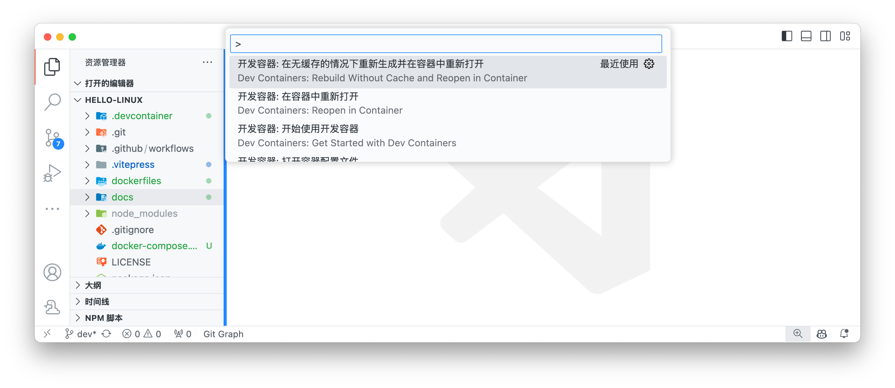

# 启动项目


## 安装

### 在 Ubuntu 中安装 ROS2

可以参考 [一行代码搭建机器人开发环境(ROS/ROS2/ROSDEP)](https://fishros.org.cn/forum/topic/20/小鱼的一键安装系列) 进行安装，这是国内的一个 ROS 社区，提供了一键安装脚本，例如 [ROS2 2024 Jazzy 版本的安装](https://fishros.org.cn/forum/topic/2600/ros2-2024-最新版-jazzy-发布-一键安装已支持)


### 从容器中运行 ROS2

该项目，可以直接从 **VSCode** 启动 ROS2 (Jazzy) 的容器



在项目的 `dockerfiles/Dockerfile` 中，会执行 `COPY ./.cache/ros.key /usr/share/keyrings/ros-archive-keyring.gpg`，所以需要先获取 ROS2 的公钥环文件
```bash
bash scripts/get-ros-key.sh 
```
> macOS 一般使用 `zsh` 作为默认 shell


> [!TIP]
> 在启动前建议先拉取镜像，可能需要全局代理
> ```bash
> docker pull ros:jazzy-ros-base-noble
> ```
> 随后，（亲测需要）关掉代理启动容器，这是由于 Dockerfile 中使用了 TUNA 源获取 apt 软件包，而科学上网的环境可能导致容器内无法访问 TUNA 源。容器成功启动后，就可以继续使用科学上网了


如果启动失败，需要启动命令面板(`cmd+shift+p`/`ctrl+shift+p`)，选择*在无缓存的情况下重新生成并重新打开容器*，如下图



### 图形界面

#### macOS

安装 XQuartz 以在 MacOS 上获得 X11 支持. 您可以从其[官方网站](https://www.xquartz.org)下载，或使用 HomeBrew 安装：
```bash
# macOS安装xquartz
brew install xquartz --cask
```

启动xquartz，实测 `Allow connections from clients` 选项非必须条件
```bash
Run Applications > Utilities > XQuartz.app
```

启动后输入以下命令，允许其他用户连接
```bash
xhost +
# access control disabled, clients can connect from any host
```

随后启动容器，在容器中输入如下命令，检查是否可以显示图形界面（会弹出一个时钟窗口）
```bash
xclock
```

如果出现报错如下，可能需要重启容器
```bash
Authorization required, but no authorization protocol specified
Error: Can't open display: host.docker.internal:0
```

能使用图形界面是由于在启动容器时，使用了 `-e DISPLAY=host.docker.internal:0` 参数，将主机的 X11 显示器映射到容器中，在 `docker-compose.yml` 可以找到这个参数

```yaml
    environment:
      - DISPLAY=host.docker.internal:0
```


### 启动 ROS demo

在终端中启动 ROS2 的小乌龟demo
```bash
ros2 run turtlesim turtlesim_node
# [INFO] [1735910105.083618756] [turtlesim]: Starting turtlesim with node name /turtlesim
# [INFO] [1735910105.098834214] [turtlesim]: Spawning turtle [turtle1] at x=[5.544445], y=[5.544445], theta=[0.000000]
```

在另一个终端中启动键盘控制小乌龟
```bash
ros2 run turtlesim turtle_teleop_key
# Reading from keyboard
# ---------------------------
# Use arrow keys to move the turtle.
# Use g|b|v|c|d|e|r|t keys to rotate to absolute orientations. 'f' to cancel a rotation.
# 'q' to quit.
```

到此，ROS2 的基本安装

### 启动 Rviz2

在终端中启动 Rviz2
```bash
ros2 run rviz2 rviz2
# or just
# rviz2
```


> [!WARNING]
> 如果您正在使用 macOS，并通过容器的方式启动 rviz2 ，那么可能无法启动成功，这似乎是与 OpenGL 的版本有关，参考[Impossible to run Rviz2 from a Docker container on Apple Silicon #929](https://github.com/ros2/rviz/issues/929)